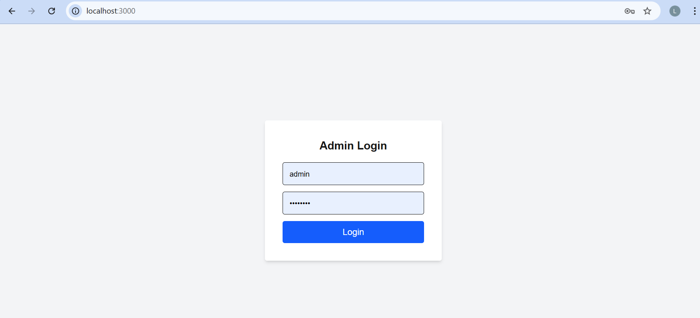
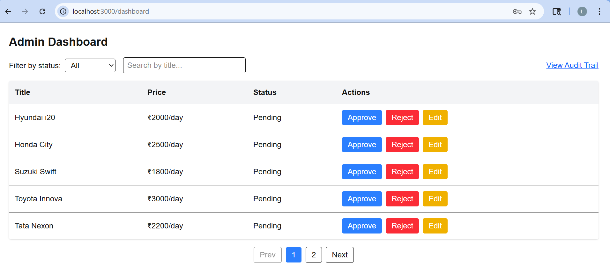
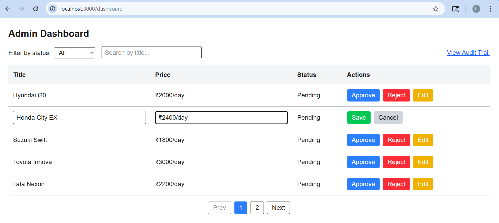
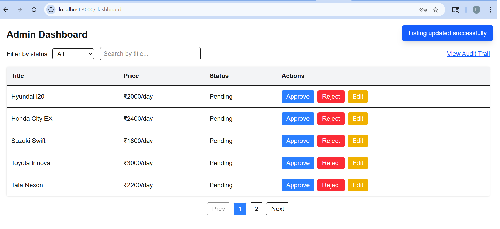
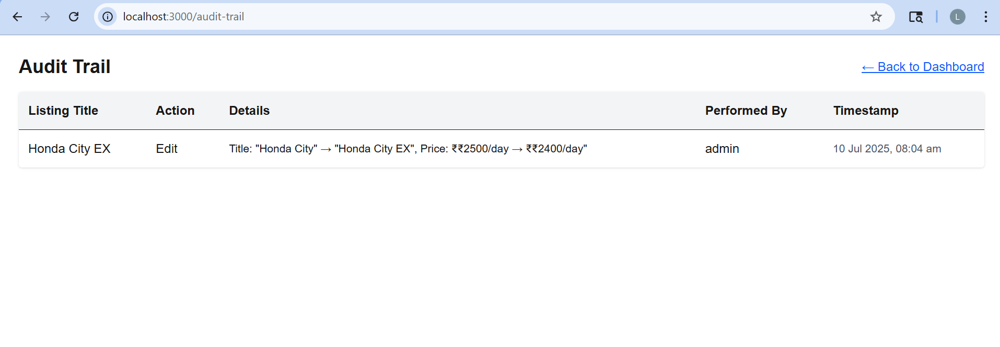

# Admin Dashboard - Car Listings Management (Next.js)

This is a functional Admin Dashboard built using modern web technologies like **Next.js**, **SQLite**, and **TailwindCSS**.  
It allows admins to manage user-submitted car rental listings with features like approval, rejection, editing, audit trail, and toast feedback.

# Features

- Admin login (mocked with hardcoded credentials)
- Dashboard displaying all car rental listings
- Approve, Reject, and Edit each listing
- Search listings by title and filter by status (pending / approved / rejected)
- Audit Trail showing logs of all admin actions with timestamps
- Pagination with 5 listings per page
- Toast feedback messages after actions like approval or update

# Tech Stack

- Next.js with getServerSideProps
- SQLite using better-sqlite3
- React Context API for auth and feedback
- Tailwind CSS for styling
- Custom API Routes (/api/listings, /api/audit)

# Prerequisite: Install SQLite

Before running the app, make sure **SQLite** is installed on your system:

- **macOS**
  ```bash
  brew install sqlite
  ```

- **Ubuntu/Debian**
  ```bash
  sudo apt update && sudo apt install sqlite3
  ```

- **Windows**  
  Download from: [https://www.sqlite.org/download.html](https://www.sqlite.org/download.html)

To confirm installation:
```bash
sqlite3 --version
```

# How to Use Locally

1. Clone and Install

   ```bash
   git clone https://github.com/your-username/admin-dashboard.git
   cd admin-dashboard
   npm install
   ```

2. Seed the database

   ```bash
   node db/seed.js
   ```

3. Run the app

   ```bash
   npm run dev
   ```

The dashboard will be running on http://localhost:3000

# Admin Credentials

| Username | Password  |
|----------|-----------|
| admin    | admin123  |

# Folder Overview

- **pages/** – Contains all the routes:
  - `index.js` for the login page
  - `dashboard.js` for the admin panel
  - `audit-trail.js` to view action logs
  - Also includes API routes under `pages/api/` for listing actions and audit logs

- **db/** – Contains the SQLite database setup and a script (`seed.js`) to populate initial data

- **context/** – Context files for managing authentication and feedback messages globally

- **components/** – Reusable UI components like the toast notification

- **styles/** – Tailwind CSS global style

## Screenshots

**Login Page**  


**Dashboard**  


**Edit Mode (Inline Form)**  
*Shows editing a listing directly in the table*  


**Toast Message (Feedback Notification)**  
*Success message after approving/editing a listing*  


**Audit Trail**  


## Demo Video

Here’s a short walkthrough of the app:  
🎥 [Watch on Google Drive](https://drive.google.com/file/d/1awU4mRq5ql9EdIlnv1c7S3Rl5H5Yyzw2/view?usp=sharing)
